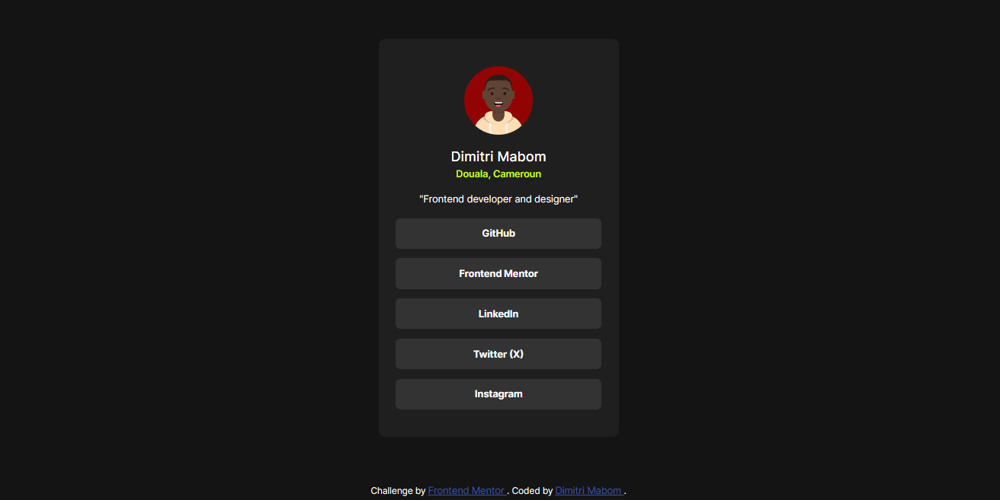

# Frontend Mentor - Social links profile solution

This is a solution to the [Social links profile challenge on Frontend Mentor](https://www.frontendmentor.io/challenges/social-links-profile-UG32l9m6dQ). Frontend Mentor challenges help you improve your coding skills by building realistic projects.

## Table of contents

- [Overview](#overview)
  - [Screenshot](#screenshot)
  - [Links](#links)
- [My process](#my-process)
  - [Built with](#built-with)
  - [What I learned](#what-i-learned)
  - [Useful resources](#useful-resources)
- [Author](#author)

## Overview

### Screenshot



### Links

- Solution URL: [https://github.com/dimysenpai/social-links-profile](https://github.com/dimysenpai/social-links-profile)
- Live Site URL: [https://social-links-profile-3xih.onrender.com/](https://social-links-profile-3xih.onrender.com/)

## My process

### Built with

- Semantic HTML5 markup
- CSS custom properties
- Flexbox

### What I learned

I remembered how to declare variables in css:

```css
:root {
  --green: hsl(75, 94%, 57%);
  --white: hsl(0, 0%, 100%);
  --grey: hsl(0, 0%, 20%);
  --dark_grey: hsl(0, 0%, 12%);
  --off_black: hsl(0, 0%, 8%);
}
```

To use it in a selection

```css
.main {
  background-color: var(--off_black);
  color: var(--white);
}
```

### Useful resources

- [Free Host - render.com](https://render.com/) - Our fastest path to production
  Build, deploy, and scale your apps with unparalleled ease – from your first user to your billionth.
- [Generate my QR Code](https://myqrcode.com/) - This site allowed me to easily generate my QR Code.
- [Font Used](https://fonts.google.com/specimen/Inter) - This font is really very beautiful

## Author

- Website - [Dimitri Mabom](https://github.com/dimitrimabom)
- Frontend Mentor - [@dimitrimabom](https://www.frontendmentor.io/profile/dimitrimabom)
- Linkedin - [Dimitri Mabom](https://www.linkedin.com/in/dimitri-mabom/)
